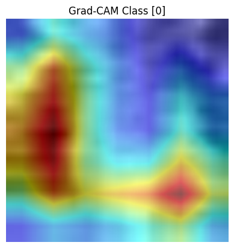
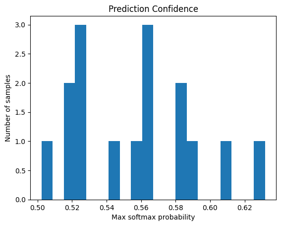
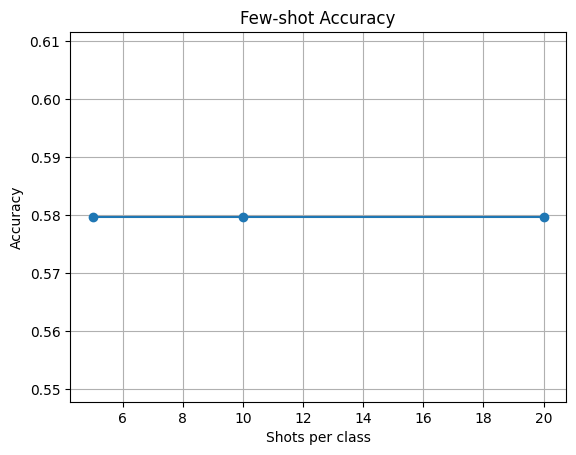

# 🩺 Few-shot Medical Image Classification

---

## 🚀 Motivation

Medical imaging faces challenges such as:

- Limited labeled data
- Uncertain predictions
- Small biomedical datasets

This project demonstrates AI learning **efficiently from few samples**, detecting uncertain predictions, and visualizing model attention, improving reliability in real-world medical image analysis.

---

## 🎯 Project Highlights

- **Few-shot learning** – Train models with 5, 10, or 20 examples per class
- **Uncertainty detection** – Identify low-confidence predictions for safer outputs
- **Small-data adaptation** – Use pre-trained ResNet18 with augmentations

**Datasets used:** PneumoniaMNIST (chest X-rays), HAM10000 (subset of skin lesions)

---

## 📊 Features & Visualizations

- **Transfer learning with ResNet18**
- **Grad-CAM** visualizations for interpretability
- **Confidence histograms** & few-shot accuracy plots
- All outputs saved in the `images/` folder

**Example Grad-CAM Visualization:**  
  

**Prediction Confidence Histogram:**  
  

**Few-shot Accuracy Plot:**  
  

---

## 🔮 Future Work

- Extend to **multi-class datasets**
- Improve **uncertainty quantification metrics**
- Explore **semi-supervised learning** for very small datasets

---

## 🌍 Real-world Impact

- ✅ Safe, interpretable predictions for medical imaging
- ✅ Practical solution for **small datasets**
- ✅ Foundation for **AI-assisted diagnostics**
